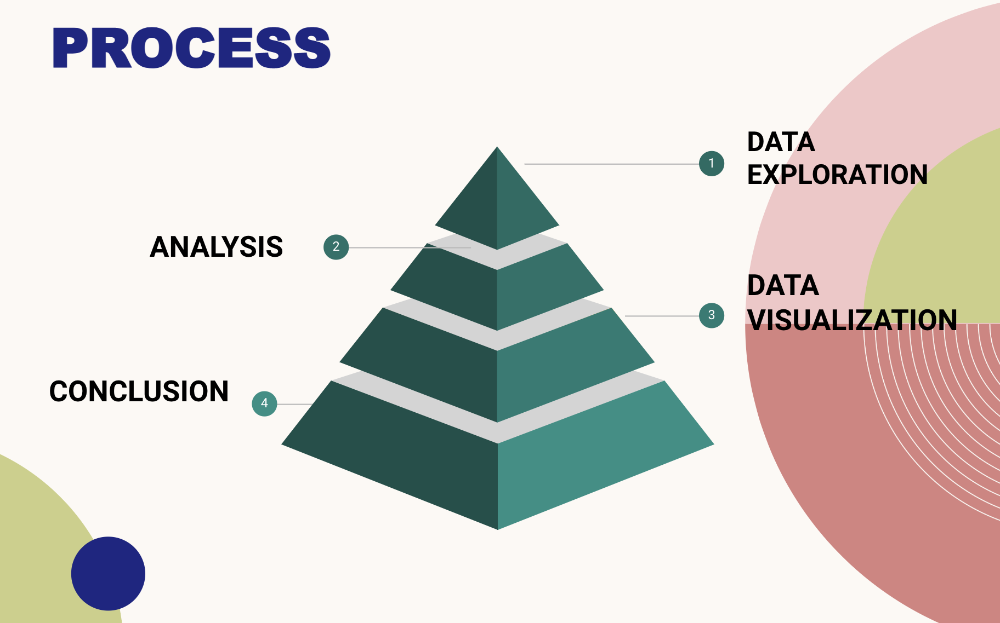
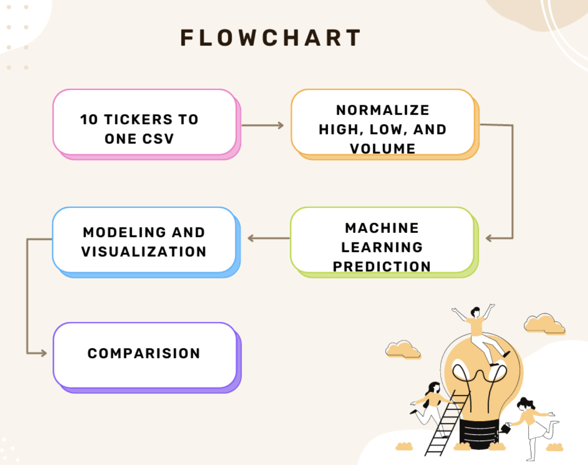
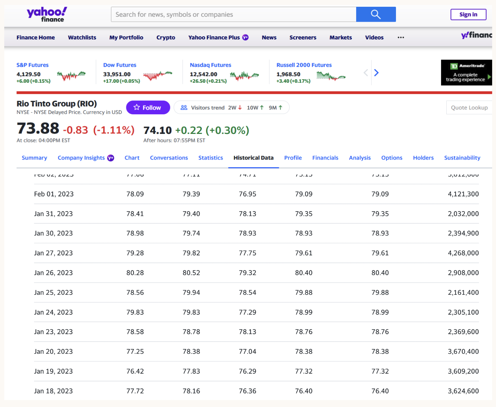
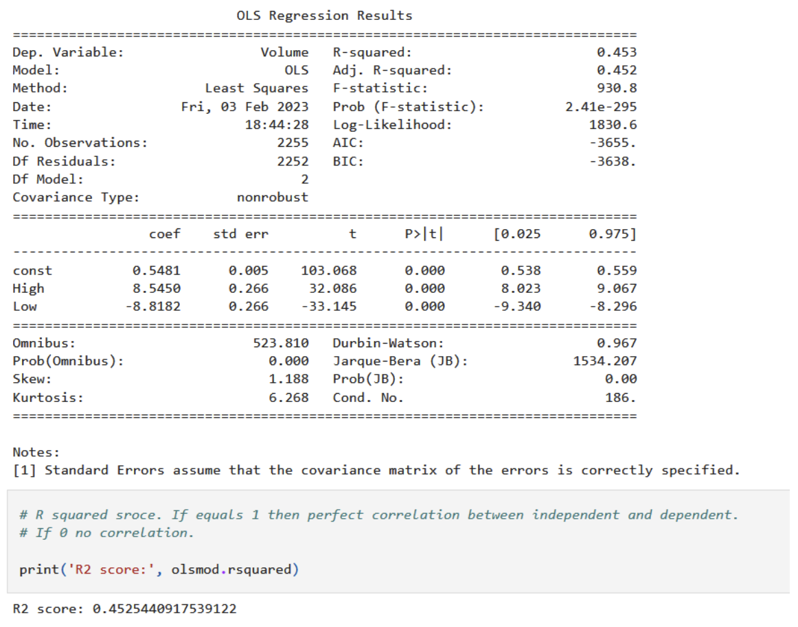
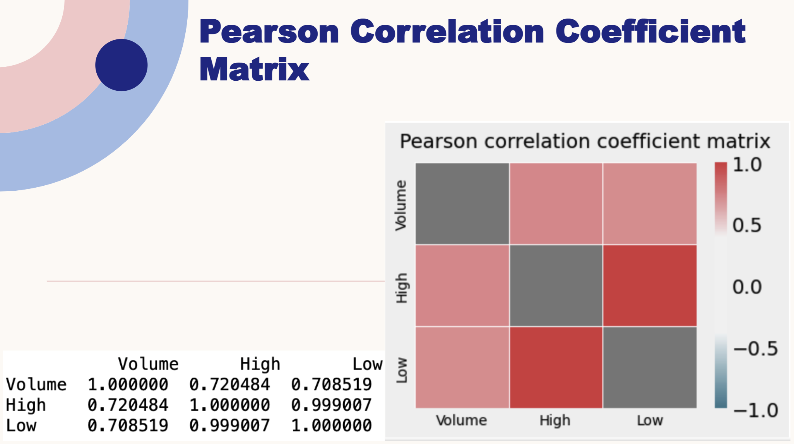
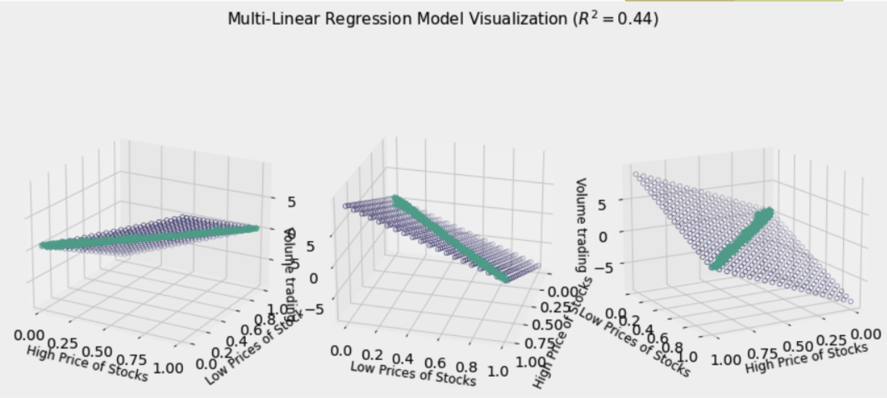

# Finance_Group_Project

## Intro 
In this project our goal is to use multiple indices to show correlations between sectors and Bitcoin. We will be analyzing Stocks in two manners, internal and external correlation. Internal correlation will be between different sectors and will determine if there is a correlation between high & low prices and volume trading in a span of 10 years.  External correlation will be between all sectors and Bitcoin. 

Our steps for this project include attaining ten years of stock data for five sectors that include HealthCare, Technology, Automobile, Materials, Commerce, and Bitcoin. Data for the former sectors was obtained from Yahoo Finance in the form of CSV files. Yahoo finance provides CSV files with the date; open, high, low, close, adj_close, and volume.
Databases for these sectors were created via Python and SQL and output as CSV files. These databases were normalized using in MinMaxScaler from sklearn.preprocessing.

## Purpose & Goals
- To understand the effect of stock prices on trading volume for different business sectors.
- What is the correlation between stock sectors and cryptocurrency? 

## Background Overview

- Technology industry developed greatly over last decades and dramatically impact on life styles, e.g. apple watch starts to check health!
- Transportation industries refers to industries in the for-hire transportation and warehousing sector, such as air, rail, water, and truck transportation.
- Consumer Cyclical & Commerce Consumer cyclicals are a category of stocks that rely heavily on the business cycle and economic conditions. Consumer cyclicals include industries such as automotive, housing, entertainment, and retail.
- Healthcare The healthcare industry is an aggregation and integration of sectors within the economic system that provides goods and services to treat patients with curative, preventive, rehabilitative, and palliative care.
- The Materials Sector encompasses a wide range of commodity-related manufacturing industries. Included in this sector are companies that manufacture chemicals, construction materials, glass, paper, forest products and related packaging products, and metals, minerals and mining companies, including producers of steel.

## Analysis Process Steps
- Process overview as below

- Flow chart for the process

- Main tools used in this analysis

#### e.g. Materials 
Tickers utilized to represent the materials sector were selected based off of market cap from simplywall.st. The companies listed in the figure below all have the highest market caps in the materials sector raging from $69.6 billion to $30.2 billion.

Using yahoo finance, historical ticker data for each stock was pulled from January 18th 2013 to January 18th 2023. Yahoo finance provides CSV files with date of information; open, high, low, close, adj_close, and volume. For this project we are only interested in volume, high, and low data. Thus, SQL was used to pull and merge data from individual csv files.

## Example of results
- OLS REGRESSION AND R2 SCORE

- Pearson Correlation Coefficient Matrix

- 3D scatter Plot

## Example of SQL code

However, as we are trying to merge multiple data sets across different sectors, it was found that the data needs to be normalized. In this case, MinMaxScaler from sklearn.preprocessing was used to normalize volume, high, and low to a set of data point between 0 and 1. This allows us to compare our large sets of data more accurately. 

### Scaler Python Code

