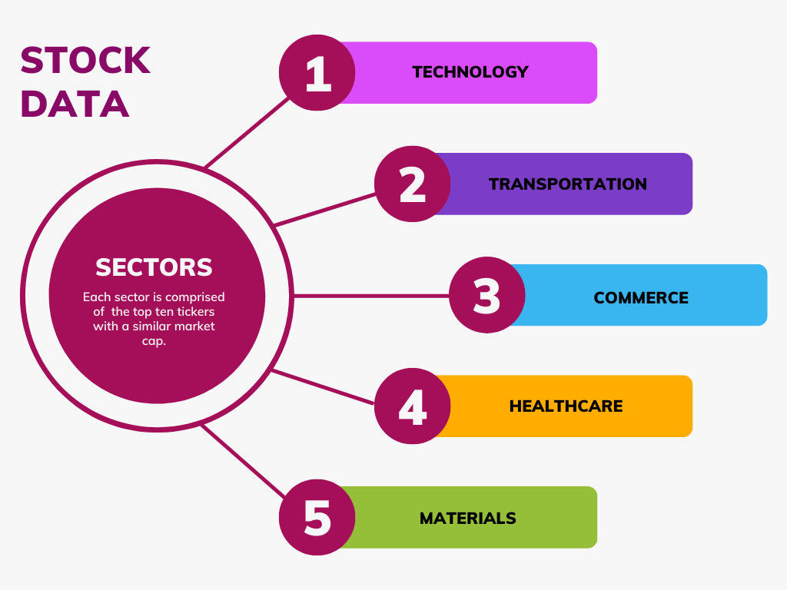
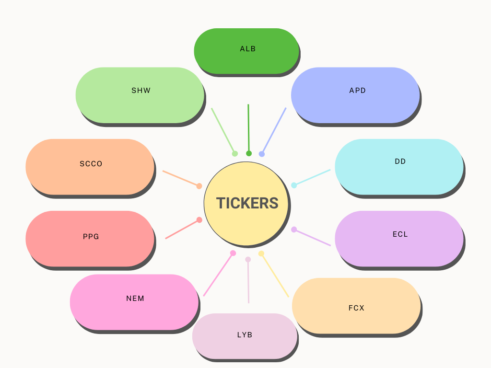
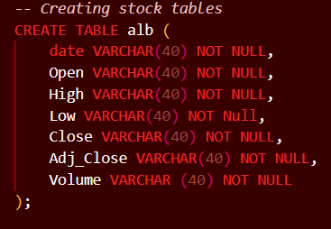
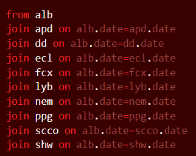
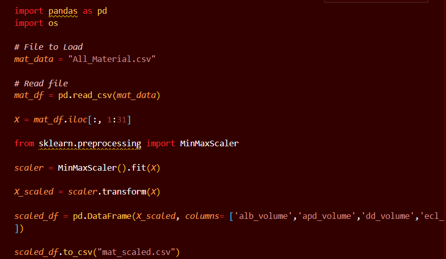

# Finance Group Project

## Materials 
Tickers utilized to represent the materials sector were selected based off of market cap from simplywall.st. The companies listed in the figure below all have the highest market caps in the materials sector raging from $69.6 billion to $30.2 billion.

Using yahoo finance, historical ticker data for each stock was pulled from January 18th 2013 to January 18th 2023. Yahoo finance provides CSV files with date of information; open, high, low, close, adj_close, and volume. For this project we are only interested in volume, high, and low data. Thus, SQL was used to pull and merge data from individual csv files.

### Example of SQL code

However, as we are trying to merge multiple data sets across different sectors, it was found that the data needs to be normalized. In this case, MinMaxScaler from sklearn.preprocessing was used to normalize volume, high, and low to a set of data point between 0 and 1. This allows us to compare our large sets of data more accurately. 

### Scaler Python Code

